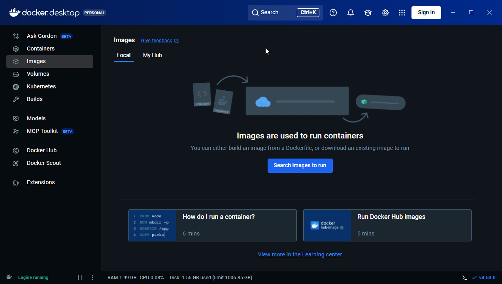
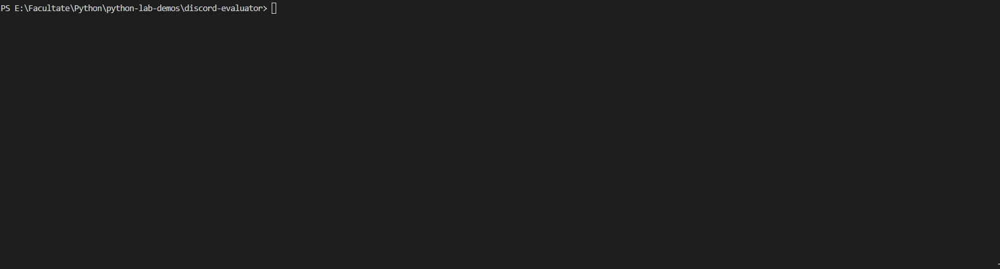

# Discord evaluator

Automate Python homework evaluation using Discord & Docker.

## Setup for Discord bot

1. Make a Discord account and head over to the [Developer portal](https://discord.com/developers/applications/)
2. Create a new application
3. Under the _Installation_ tab:
    * make sure that both _User install_ and _Guild install_ are checked
    * use the _Install link_ to register your bot to a server you own / moderate
4. Under the _Bot_ tab:
    * make sure that both _Server Member Intent_ and _Message Content Intent_ are checked
    * copy the _API Token_ string
    * you can also give some the bot a custom username
5. Under the _OAuth_ tab:
    * make sure you checked the _bot_ scope
    * then, check the following bot permissions: _View Channels + Send Messages + Attach Files + Read Message History_
    * check _Guild Install_ for the Integration Type
    * you should have a link that looks like this: `https://discord.com/oauth2/authorize?client_id=<CLIENT_ID>&permissions=101376&integration_type=0&scope=bot`
    * then, just copy-paste it into your browser and follow the install instructions.

## Setup for Docker Desktop

1. Download [Docker Desktop](https://www.docker.com/products/docker-desktop/) and install it (**no account required for this demo**)
2. Download `python:3.11-slim`

    

You can choose any other Docker image as long as it has a Python interpreter.
_I've chose this one because it's a lighter build._

## Setup for the script

1. First, install everything using `pip install -r requierments.txt`
2. Create a `.env` file where you paste your _API\_TOKEN_
3. Run the script to create a folder structure. By default, it will generate the following structure:
```
lab_1/
├── tester.py
└── submissions/
```
4. Edit `tester.py` to create your own testing algorithms & cases.
5. Run the script again `python3 main.py`

    

## How it works

The script used Discord API (via `discord.py`) to accept incoming `.py` files and as a sort-of authorization step: only users that are present on the same server as the bot can send messages to it.
Then, it executes these files in an isolated Docker container (via `docker.py`) to prevent damage on the host.

The `tester.py` script handles the actual score points & testing.
Being run inside the container, it uses JSON (via `json.py`) to communicate back the results to the host OS.

The `.env` file (accessed via `python-dotenv`) ensures that the API token is not stored in the script file (we wouldn't want to accidently disclose it).

The `signal` library is used to capture CTRL+C (better known as `SIGINT`) and allow a graceful shutdown, which includes saving the scoreboard.

The scripts should handle all errors, but in the case this doesn't happen, please open an issue so I can take a look 👀